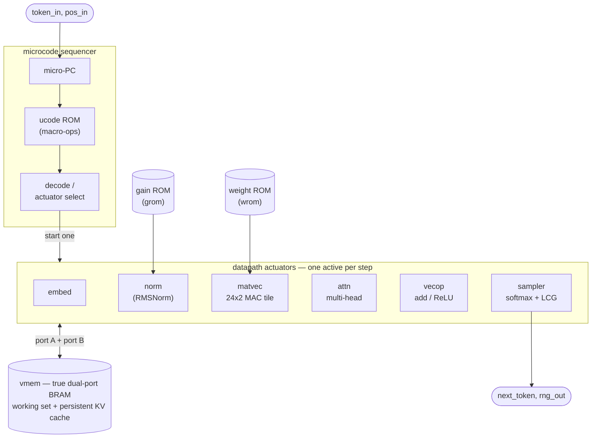

# gateGPT

**gateGPT** is a hardware (RTL) implementation of [Andrej Karpathy's nanoGPT](https://github.com/karpathy/nanoGPT)
— a small character-level GPT — running entirely on a **Xilinx Virtex-5** FPGA (XC5VLX110T, XUPV5 /
ML509 board, ISE 14.7, Verilog-2001), here trained to generate names. The model (one transformer
block: RMSNorm → multi-head causal attention → MLP, in Q5.11 fixed point) executes as a
**microcode-ROM sequencer** driving modular datapath actuators over a shared dual-port scratchpad;
**incremental decoding with a persistent KV cache** computes only the new token's K/V each step and
attends over the cached context, instead of recomputing the whole window. It generates names on the
board's character LCD at **around 50,000 tokens/second at 80 MHz**, while a rotary encoder sets the
generation speed and the sampling temperature.

This is an independent design — the RTL, the fixed-point spec, the microcode ISA, and the trained
weights are all our own. Throughput improved **28×** over the first working version (from ~2.4k to
**~50–69k tokens/second**, depending on context length), all bit-exact to a Python reference and
confirmed generating names on the board (closing timing post place-and-route at 80 MHz).

---

## Architecture

The inference core is a **microcode-ROM sequencer driving modular datapath actuators** — not
a hand-coded monolithic state machine. A small program ROM (`generated/ucode.hex`, produced by
`tools/ucode_asm.py`) encodes the transformer schedule as macro-ops; a micro-PC fetches one per
step, starts the matching actuator, and waits for `done`. Actuators share a true dual-port
activation scratchpad (`vmem`, one Block RAM) that also holds the persistent KV cache.



Datapath actuators (`core/`):

| Module | Role |
|---|---|
| `matvec` | parallel multiply-accumulate tile — the linear projections (24 lanes × 2 columns/cycle) |
| `norm` | RMSNorm (`udiv` + `isqrt` primitives), 2 elements/cycle on the dual-port vmem |
| `attn` | single-position multi-head causal attention with per-head parallel dividers |
| `exp_unit` | fixed-point `exp` via table + linear interpolation |
| `sampler` | temperature softmax + LCG categorical sampling, or greedy argmax |
| `embed`, `vecop` | embedding lookup, residual add / ReLU |
| `wrom`, `grom`, `vmem2` | wide weight ROMs, RMSNorm gains, true dual-port activation scratchpad |

**Model:** 1 transformer block, `n_embed=24`, 4 heads × head-dim 6, MLP hidden 96, context 16,
vocabulary 27 (`.` + `a`–`z`). All arithmetic is signed **Q5.11** fixed point (FRAC=11). The
Python integer reference (`tools/fixedpoint.py`) is the bit-exact specification the RTL matches.

| Parameter | Value |
|---|---|
| Blocks / heads / head-dim | 1 / 4 / 6 |
| Embedding / MLP hidden | 24 / 96 |
| Context (block size) / vocab | 16 / 27 |
| Number format | Q5.11 signed 16-bit |
| RNG / divide | 32-bit LCG / truncate-toward-zero |
| RMSNorm | integer `isqrt` + reciprocal |
| `exp` | 17-entry table + linear interpolation |

---

## Results — the optimization journey

Every step below is **bit-exact** to the Python reference (greedy `alaya`, sampled `rosphod`
at seed 2, T=0.7) and verified in the iSim oracle. Throughput is per-token at the board clock.

| # | Stage | Key change | Cycles/token | tok/s @ 80 MHz | LUT | DSP | Status |
|---|---|---|---:|---:|---:|---:|---|
| 0 | First core | microcode core, recompute full 16-tok context | 32,872 | 2,433 | 8.6k | 15 | 33 MHz board |
| 1 | Timing rework | vmem→BRAM (registered read), read-ahead, pipelining | 32,872 | 2,433 | ~9k | 15 | **80 MHz** board |
| 2 | KV cache | incremental decode, absolute positions, persistent K/V | 10,192 | 7,849 | ~9k | 15 | 80 MHz |
| 3 | Parallel MAC | 24-lane systolic matvec tile | 2,757 | 29,016 | 14k | 35 | 80 MHz |
| 4 | Parallel attn dividers | per-head concurrent softmax divides | 1,781 | 44,919 | 14k | 35 | **80.2 MHz** board |
| 5 | radix-4 `udiv` | divider does 2 quotient bits/cycle | 1,541 | 51,914 | – | – | 80 MHz |
| 6 | narrow `isqrt` + matvec writeback overlap | 32-bit isqrt; writeback hides behind next tile | 1,428 | 56,022 | 17k | 35 | **80 MHz** board |
| 7 | dual-port vmem + RMSNorm 2×/cycle | true dual-port BRAM scratchpad | 1,356 | 58,997 | – | – | (intermediate) |
| 8 | matvec 2 cols/cycle + 2 rows/cycle writeback | double-width weight ROM, dual-port reads/writes | 1,145 | 69,869 | 16.7k | 62 | needed pipelining |
| 9 | **operand pipeline (final)** | extra register stage before the multiply closes timing | 1,156 | **69,204** | 15.5k | 62 | **80 MHz** board ✅ |

**Throughput, final design @ 80 MHz** (bit-exact, post-PAR closed at 12.461 ns, 0 timing errors):

| Metric | Cycles/token | tok/s |
|---|---:|---:|
| First token (best case) | 1,156 | ~69,200 |
| Average over a full name | 1,321 | ~60,600 |
| Longest-context token | 1,488 | ~53,800 |

### FPGA resource utilization

Full board (inference core + LCD driver + rotary control + tok/s meter + DCM) on the
**XC5VLX110T-1 FF1136**, post-PAR at 80 MHz (min period 12.458 ns, 0 timing errors):

| Resource | Used | Available | Util. |
|---|---:|---:|---:|
| Slice LUTs | 16,548 | 69,120 | 23% |
| &nbsp;&nbsp;— as logic | 16,427 | 69,120 | 23% |
| &nbsp;&nbsp;— as distributed RAM | 56 | 17,920 | <1% |
| Slice Registers (FF) | 5,530 | 69,120 | 8% |
| Occupied Slices | 5,362 | 17,280 | 31% |
| **DSP48E** | **62** | **64** | **96%** |
| Block RAM (RAMB36) | 2 | 148 | 1% |
| BUFG | 2 | 32 | 6% |
| DCM_ADV | 1 | 12 | 8% |
| Bonded IOBs | 29 | 640 | 5% |

**DSP is the binding resource** — the 24-lane × 2-column matvec tile uses 48 of the 62. Everything
else is comfortable (≤31%). The activation scratchpad + KV cache fit in a single dual-port Block RAM;
the weight/embedding/microcode ROMs are LUT-baked constants (see the bring-up note below).

### Logic-gate estimate

FPGA resources don't map 1:1 to ASIC gates, but converting each primitive to **2-input-NAND
equivalents** (factors in parentheses) puts the whole design's complexity in perspective:

| Element | Count | × gates/elem | Gate-equiv |
|---|---:|---:|---:|
| Logic LUT6 | 16,427 | × 12 | ~197,000 |
| Flip-flops | 5,530 | × 6 | ~33,000 |
| DSP48E (as a 16×16 MAC) | 62 | × 3,500 | ~217,000 |
| **Total logic** | | | **≈ 450,000 (~0.45 M) gates** |
| Block RAM (SRAM) | 2 × 36 Kb | (memory) | ~74 Kbit on-chip |

So the active design is on the order of **~0.45 million NAND2-equivalent gates** — the LUT fabric and
the DSP multipliers each contribute about half — plus ~74 Kbit of on-chip SRAM (the activation
scratchpad + KV cache). This is a *rough* figure: LUT- and DSP-to-gate conversions vary by roughly
±2×, and FPGA logic doesn't translate cleanly to a standard-cell count.

---

## Key engineering lessons

- **KV cache is the single biggest win** (3.2×): recomputing the whole context every token is
  the dominant cost in a naïve decoder. Switching to absolute-position training enabled it.
- **Post-synthesis Fmax lies under congestion.** A 2-columns/cycle matvec reported 88 MHz
  post-synth but collapsed to 35 MHz post-PAR — because a mis-written dual-port template made
  XST infer the 1024×16 scratchpad as **16,384 flip-flops** instead of a Block RAM (look for
  `N flip-flops were inferred for signal <mem>` in the HDL report). The fix: **one `always`
  block per port** for the true-dual-port BRAM template. LUT dropped 46.7k → 16.7k.
- **Break long BRAM→DSP nets with a register.** The final 0.14 ns to 80 MHz was closed by
  pipelining the activation/weight operands one extra stage so the high-fanout BRAM-output net
  stays off the multiply's critical path.
- **Exact integer arithmetic is free to parallelize.** radix-4 division and split MAC lanes
  preserve the floor-divide / saturating results, so the golden never changes.

### Hardware bring-up: two XST 14.7 bugs that pass simulation but hang the board

The bit-exact iSim golden passed at every step, yet the first board run **hung** (frozen banner,
`gen_busy` stuck, 0 tok/s) while the rotary/LEDs still worked. Two XST 14.7 synthesis-vs-sim
divergences were the cause — neither shows up in RTL simulation:

- **`$readmemh` ROMs get tied to zero.** XST silently zeroes small `$readmemh` distributed-ROM
  arrays (look for `Signal <name> is used but never assigned. Tied to default value` in the `.syr`).
  This zeroed the **microcode** ROM → the sequencer ran all-NOP, never hit `HALT`, and hung; it
  also zeroed the weights/exp/embeddings → garbage output. `$readmemb` does **not** help (same
  mechanism). Fix: emit every ROM the core reads as a **combinational `case` function** (explicit
  constants XST bakes into LUTs reliably) — see `core/ucode_rom.vh`, `wrom_data.vh`, `tok_emb.vh`,
  `pos_emb.vh`, `exp_data.vh`, `gains.vh`. Verify the `.syr` "tied to default" list is empty.
- **A live register can be constant-folded away.** XST trimmed the matvec's tile base `obase` to
  constant 0 (`has a constant value of 0 ... will be trimmed`), so every **multi-tile** matmul
  (fc1/lm) looped forever — the core hung at microcode `pc=9` (the fc1 matvec). A `pc`-on-LEDs
  debug probe localized it. Fix: `(* keep = "true" *)` on `obase`/`wbase`. Also avoid bit-selecting
  an `integer` parameter (`LANES[6:0]`) — assign it to a sized `localparam` first.

**Takeaway:** post-PAR timing closure ≠ a working design. On XST 14.7, never trust `$readmemh` for
ROM init (use `case` functions), and treat "constant value / tied to default" warnings as bugs.
With both fixed, the board generates names correctly at 80 MHz.

---

## Layout

```
core/         independent inference core (RTL) + generated includes (*.vh)
board/        XUPV5 top, HD44780 LCD driver, rotary control, tokens/sec meter, UCF
tools/        model, training, fixed-point reference, weight/microcode export
data/         public makemore names corpus (training data)
generated/    fixed-point weight ROMs (*.hex) + microcode program (ucode.hex)
sim/          iSim testbenches (per-actuator + end-to-end golden)
```

## Build & run

Train and export the model artifacts (Python 3 + numpy + torch):

```bash
python tools/train.py            # -> tools/weights.npz
python tools/export.py           # -> generated/*.hex, core/core_params.vh, gains.vh
python tools/ucode_asm.py        # -> generated/ucode.hex, core/coremap.vh
```

Simulate the core against the golden (Xilinx iSim):

```bash
fuse -incremental -prj tb_core.prj -o sim/tb_core_sim work.tb_core
./sim/tb_core_sim -tclbatch sim/isim_run.tcl     # prints CYCLES_PER_TOKEN + CORE PASS
```

Build the board bitstream (ISE 14.7): `xst → ngdbuild → map → par → trce → bitgen` against
`xupv5_microgpt_top.prj` / `board/xupv5_microgpt.ucf` for part `xc5vlx110t-1-ff1136`.

## Board

Verified on the XUPV5: names generate and scroll on the LCD at 80 MHz.

- 100 MHz oscillator → DCM CLKFX ×4/5 → **80 MHz** core clock.
- Names auto-generate; the **rotary encoder** adjusts one of two settings, chosen by
  **pressing** it:
  - **RATE** — auto-rotation speed, from ~1 Hz (readable) up to back-to-back (max throughput).
  - **TEMP** — sampling temperature, `T = 0.5 … 1.2` in 0.1 steps (default 0.7).
- `led[5]` lights while in TEMP mode. LCD row 1 shows the current name; row 2 shows the active
  setting (`rate: NNNNN t/s` measured, or `temp: X.Y`). `led[7]` is a 1 Hz heartbeat.
```
